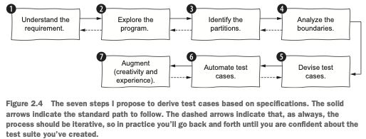

# Trabalho Prático de Teste Baseado em Especificação
Método para adição de números inteiros muito, muito grandes

## O problema implementado a ser testado
### Descrição geral
Considere a descrição mostrada a seguir de um pequeno método que faz a operação de adição de dois números de qualquer tamanho. Perceba que esse problema parece ser um _toy example_, mas é útil em computação científica uma vez que para certas aplicações é necessário fazer cáculos matemáticos com números inteiros muito, muito grandes. Nessa situação, os tipos básicos e os operadores matemáticos das linguagens de programação não suportam o cáculo.

### Especificação de requisitos
O método deve:

- Receber como entrada duas variáveis chamadas `left` e `right` que representam dois números inteiros grandes:
    - `left` porque é o número à esquerda da operação de adição;
    - `right` porque é o número à direita da operação de adição;
    - Cada uma é representada como uma lista de dígitos;
- Produzir como saída a soma (como uma lista de dígitos) dos números representados nas duas variáveis;
- Cada elemento nas listas de dígitos `left` e `right` deve ser um número de [0-9]:
    - Uma `IllegalArgumentException` é lançada se esta pré-condição não for mantida;
- Caso `left` ou `right` seja:
    - nulo, deve-se retornar `null`;
    - uma lista vazia, considere que é o número 0;
- Exemplo:
    - Os números 23 e 42 estão na lista (`left`) como dois elementos [2,3], e na lista (`right`) como dois elementos [4,2].
    - Como saída, é produzida uma lista com dois elementos [6,5], uma vez que 23 + 42 = 65.

### A solução implementada

```java
public List<Integer> add(List<Integer> left, List<Integer> right) {
  if (left == null || right == null)
      return null;
  Collections.reverse(left);
  Collections.reverse(right);  
  LinkedList<Integer> result = new LinkedList<>();
  int carry = 0;
  for (int i = 0; i < Math.max(left.size(), right.size()); i++) {
      int leftDigit = left.size() > i ? left.get(i) : 0;
      int rightDigit = right.size() > i ? right.get(i) : 0;

      if ((leftDigit < 0) || (leftDigit > 9) || (rightDigit) < 0 || (rightDigit > 9))
          throw new IllegalArgumentException();

      int sum = leftDigit + rightDigit + carry;
      result.addFirst(sum % 10);
      carry = sum / 10;
  }

  return result;
}
```

## O trabalho prático

### Instruções de entrega
A solução deve ser enviada em um arquivo em formato `.zip` com o nome `RA.zip`, no qual "RA" é o número de seu RA. Por exemplo, um aluno com RA 123456 deve enviar um arquivo com o nome `123456.zip`.

### Teste a solução implementada usando teste baseado em especificação
Para tanto siga o processo abordado em aula e apresentado na figura a seguir:




Para documentar o processo usado, escreva um relatório descrevendo como foi executado cada passo do processo. Seu relatório deve ter:

1. Uma seção do relatório deve descrever o “Passo 2”, em que você deve explorar o funcionamento do programa em teste;
2. Uma seção do relatório deve descrever o “Passo 3”, que identifica as partições:
    - Para cada entrada individualmente;
    - Para combinações de entradas;
    - Para saídas esperadas;
3. Uma seção do relatório deve descrever o “Passo 4”, que identifica os valores limite;
4. Uma seção do relatório deve descrever o “Passo 5”, em que você deve derivar os casos de teste;
5. Uma seção do relatório deve descrever o “Passo 6”, em que você deve automatizar os casos de teste usando JUnit;
6. Uma seção do relatório deve descrever o “Passo 7”, caso você aumente a suíte de testes com casos criados ou alterados a partir de seu instinto;

O relatório deve estar em formato `.pdf` ou `.html` e deve ter o nome `relatorio.pdf` ou `relatorio.html`. O arquivo com relatório deve ser colocado na pasta raiz do projeto do arquivo `RA.zip`.

Os casos de teste implementados em JUnit no "Passo 6" do teste basedo em especificação também devem estar no arquivo `RA.zip`.

## Dicas

### VSCode

Preferencialmente use o VSCode. Installe os seguintes _plugins_:

- Extension Pack for Java
- Debbuger for Java
- Test Runner for Java
- Maven for Java
- Project Manager for Java
- Coverage Gutters

Use o projeto disponibilizado como base para seu projeto, é mais fácil do que criar um novo projeto.

### Sobre o relatório

Na pasta do projeto disponibilizado existem dois arquivos de relatório com exemplo de como deve ser o seu relatório:

- ``Relatorio.qmd``: código-fonte _markdown_ com um exemplo de relatório a ser entregue;
- ``Relatorio.html``: ``.html`` gerado a partir do processamento do arquivo ``Relatorio.qmd`` usando o sistema de publicação [Quarto](https://quarto.org).

Se você desejar pode entregar seu relatório usando o Quarto também. Para isso, instale o Quarto e o respectivo _plugin_ do VSCode, conforme instruções [daqui](https://quarto.org/docs/get-started/) e [daqui](https://quarto.org/docs/get-started/hello/vscode.html).

## Considerações finais

Tenha certeza de ter excluído arquivos ``.class``, ``.jar``, ``.war`` e outros ``.zip``. Não é necessário, nem se deve, enviar arquivos grandes.

Tenha certeza que arquivo ``RA.zip`` contenha:

1. O projeto Java:
    - com a solução implementada [``add()``](#a-solução-implementada), que deve estar em uma classe do projeto;
    - de maneira que possa ser compilado no VSCode;
2. O relatório da execução dos passos do processo definido para o teste baseado em especificação:
    - com todas as 6 seções descrevendo os passos do processo;
3. Os casos de teste gerados durante a execução do processo:
de maneira que possam ser executados no VSCode.