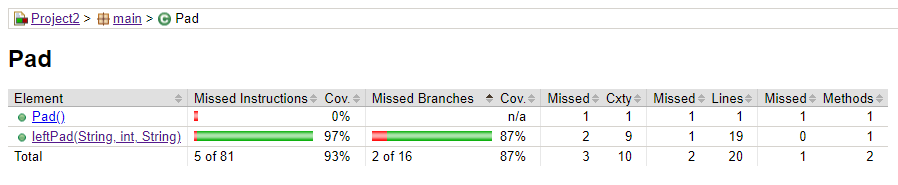
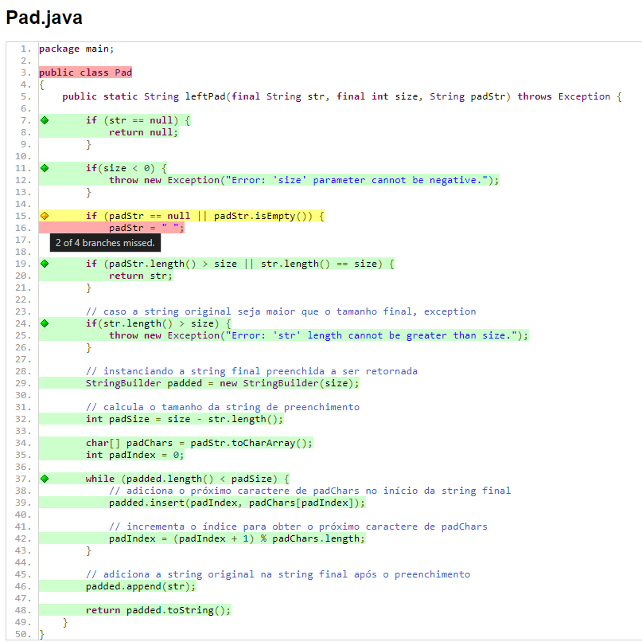
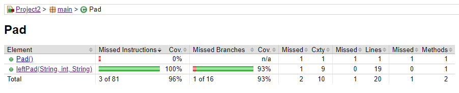
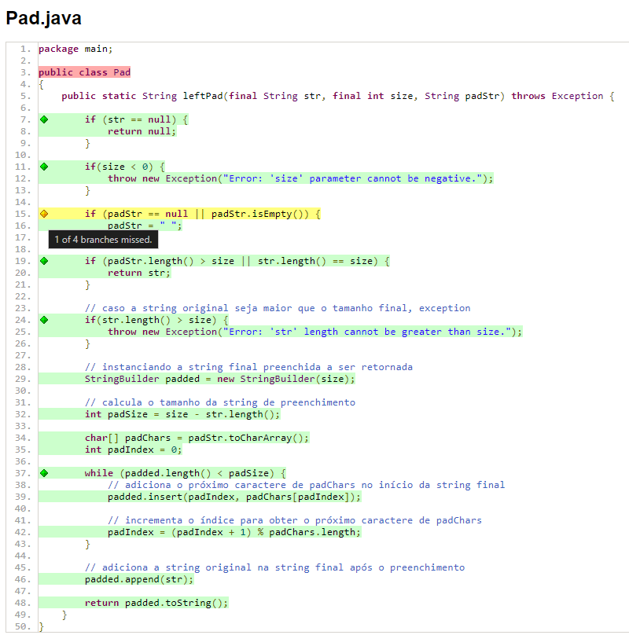

# Trabalho Prático de Teste Baseado em Especificação e Teste Estrutural
Método ``leftPad()``

<br>

**Autor**<br>
[Gustavo Zanzin Guerreiro Martins](https://www.linkedin.com/in/gustavo-martinx/)


## Introdução

Este documento descreve o processo utilizado para derivar casos de teste para o método `leftPad()`. Para tanto, foram utilizadas as metodologias de Teste Baseado em Especificação e Teste Estrutural. O método `leftPad()` realiza o preenchimento à esquerda de uma _string_ `str` usando outra _string_ `padStr`.


O Passo 1 deste relatório consiste em compreender os requisitos da entidade a ser testada e o Passo 2 em explorar o funcionamento do programa. No entanto, como foi solicitado, para este trabalho, a implementação do método `leftPad()`, logo tanto suas especificações quanto seu funcionamento já foram compreendidos. Portanto, este relatório descreverá a partir do Passo 3.


## Passo 3 - Identificar as partições

### Para cada entrada individualmente

#### Parâmetro `str`:

O argumento `str` deve ser um objeto Java do tipo _String_. É permitida a passagem de `str` com o valor de `null`. Nesse caso, o método `leftPad()` deve retornar `null`. Dessa forma, são estabelecidas as seguintes partições válidas e inválidas:

##### Partições válidas

- Pode ser passado como `null`;
- Pode assumir o valor de uma _string_ vazia, ou seja, `""`;
- Seu comprimento pode ser maior ou igual a 1, isto é, `len(str) >= 1`;
- Pode assumir valores de caracteres especiais (incluindo espaço em branco).

##### Partições inválidas

Com base na especificação de requisitos e sendo o parâmetro `str` do tipo _string_ (ou seja, impossível realizar a inserção de um argumento de outro tipo), não foi possível identificar partições inválidas para `str` neste caso específico.


#### Parâmetro `padStr`:

O parâmetro `padStr` também é um objeto Java do tipo _String_. Este, no método `leftPad()`, tem como papel ser o conteúdo que preencherá a _string_ de entrada. Outrossim, quando assumir os valores `null` ou string vazia (`""`) deve ser internamente tratado como um espaço em branco, ou seja, `" "`.

Entretanto, como a especificação de requisitos foi vaga e existiu o livre arbítrio relacionado às decisões de projeto durante a implementação do método, definiu-se que não há limite de comprimento para a _string_ em questão. Nesse sentido, quando `padStr` extrapola o tamanho suficiente para preencher `str`, o vetor de caracteres `padStr` é truncado.

##### Partições válidas

- Pode assumir o valor `null`;
- Pode ser passado como uma _string_ vazia, ou seja, `""`.
- Seu comprimento pode ser maior ou igual a 1, isto é, `len(padStr) >= 1`;
- Pode assumir valores de caracteres especiais.

##### Partições inválidas

Com base na especificação de requisitos e sendo o parâmetro `padStr` do tipo _string_ (ou seja, impossível realizar a inserção de um argumento de outro tipo), não foi possível identificar partições inválidas para `padStr` neste caso específico.


#### Parâmetro `size`:

Por outro lado, o parâmetro `size` é um número do tipo inteiro (`int`) no qual deve representar o comprimento máximo da _string_ preenchida que será retornada pelo método `leftPad()`. Dessa forma, obtem-se as seguintes classes de equivalência:

##### Partições válidas

- Pode ser representado por qualquer valor natural (`size >= 0`).

##### Partições inválidas

- Assumir um valor negativo (`size < 0`).


### Para combinações de entrada

De acordo com a especificação de requisitos, também é possível identificar classes de equivalência a partir da combinação dos parâmetros de entrada. Sob essa ótica, identificou-se as seguintes partições:

#### Partições Válidas
- `str` não vazia, `padStr` é `null` e `size` maior que o comprimento de `str`;
- `str` não vazia, `padStr` não vazia e `size` é igual ao comprimento de `str`;
- `str` vazia e `size` maior ou igual ao comprimento de `padStr`.

#### Partições Inválidas
- `str` é `null`, `padStr` não vazia e `size` é maior que zero;
- `str` não vazia, `padStr` não vazia e `size` é zero;
- `str` vazia e `size` menor que o comprimento de `padStr`.


### Para saídas esperadas

Investigando as possíveis saídas, nota-se que o método `leftPad()` pode retornar uma _string_, `null`, ou ainda uma `Exception`. Nesse sentido, é possível considerar diferentes valores de entrada, induzindo tais saídas.

- Partição de saída válida (`String`): engloba os casos em que o preenchimento não é necessário ou é efetuado corretamente e resulta em uma nova _string_. Esses casos são obtidos quando tem-se:
    - O parâmetro `size` maior ou igual ao comprimento de `str`.

- Partição de saída nula (`null`): abrange o caso em que o argumento `str` é passado como `null`, levando a um resultado nulo.

- Partição de exceção (`Exception`): inclui os casos em que `size` é negativo e quando o comprimento de `str` é maior que `size`. Gerando assim, para ambos os casos, o lançamento da exceção `Exception`.


## Passo 4 - Identificar os valores limites

Defeitos nos limites do domínio de entrada são comuns em sistemas de _software_. Quando cria-se partições, elas assumem valores limites próximos que “dividem” as classes de equivalência. Sempre que um valor limite é identificado, é essencial testar o que acontece com o programa quando as entradas vão de um limite para o outro. Ou seja, teste de dois pontos quando há um valor limite. Um teste é para o _in point_ , que é o ponto que está dentro da partição; e o outro teste é para o _out point_, que é o ponto mais próximo do valor limite que pertence à partição à qual o _in point_ não pertence, isto é, a outra partição.

Nessa lógica, para o método `leftPad()` serão elaborados 9 testes de bordas, de acordo com os limites das partições. A seguir serão listados os testes com os valores limites identificados:
 
#### Parâmetro `str`
- Comprimento mínimo: `""` (_string_ vazia);
- Comprimento unitário: `"a"` (_string_ com um caractere);
- Comprimento típico: Uma _string_ de tamanho médio, como `"abc"`;
- Não há limite de comprimento para `str`.

#### Parâmetro `padStr`
- Comprimento mínimo: `""` (_string_ vazia, tratada como espaço em branco);
- Comprimento unitário: `"-"` (_string_ com um caractere);
- Comprimento típico: Uma _string_ de tamanho médio, como `"pad"`;
- Não há limite de comprimento para `padStr`.

#### Parâmetro `size`
- Valor mínimo: `0`;
- Valor unitário: `1`;
- Valor típico: `5`;
- Não há limite de tamanho para `size`.


## Passo 5 - Derivar os casos de teste

Idealmente, combinaríamos todas as partições que criamos para cada uma das entradas. Entretanto, para evitar a criação deliberada que tal método resultaria, consideremos os seguintes casos de teste:

#### Casos de teste de exceção:
- T01: `str == null`;
- T02: `size < 0`;
- T03: `len(str) > size`;

#### Considerando `len(str) == 1`:
- T04: `len(padStr) == 1`, `size == 1`;
- T05: `len(padStr) == 1`, `size > 1`;
- T06: `len(padStr) > 1`, `size == 1`;
- T07: `len(padStr) > 1`, `size > 1`;

#### Considerando `len(str) > 1`:
- T08: `len(padStr) == 1`, `size > 1`;
- T09: `len(padStr) > 1`, `size > 1`.

#### Para combinações de entradas:
- T10: `len(str) > 1`, `len(padStr) >= 1`, `size > len(str)`;
- T11: `len(str) > 1`, `len(padStr) >= 1`, `size == len(str)`;
- T12: `str == ""`, `size >= len(padStr)`;
- T13: `size < len(padStr)`.


## Passo 6 - Automatizar os casos de teste usando JUnit
Não houveram dificuldades significativas na automatização dos testes do método `leftPad()`.

## Passo 7 - Aumentar a suíte de testes por meio de experiência e criatividade

Houve a tentativa de criar um caso de teste no qual o tamanho da **string** final, ou seja, `size` (que é um `int`), fosse maior que o seu valor máximo em memória (2.147.483.647). Entretanto, constatou-se que a própria linguagem de programação já trata esse caso, fazendo com que o teste não fosse possível. Em suma, a suíte de testes não foi expandida.


<br>

# Teste Estrutural e Cobertura de Código
Até aqui, foram utilizados os conceitos de teste baseado em especificação para a elaboração dos casos de teste para o método `leftPad()`.

A partir daqui, o produto das etapas anteriores será incrementado através da utilização dos conceitos de teste estrutural e cobertura de código.

## Cobertura de código dos testes baseados em especificação

O [JaCoCo](https://github.com/jacoco/jacoco) (Java Code Coverage) é uma ferramenta de análise de cobertura de código que ajuda os desenvolvedores a medir o quanto do código-fonte Java foi testado. Ele gera relatórios detalhados que indicam as porcentagens de código coberto por testes unitários e integração, bem como cada condição de cada decição que foram ou não exercitadas durante a execução dos testes.

Ao executar no terminal o comando `mvn jacoco:report`, o Jacoco executa essa análise de cobertura dos testes e gera um relatório com as métricas desse processo. Primeiramente, haverá a execução apenas para a suíte de teste composta pelos testes baseados em especificação, cujos resultados são apresentados a seguir:





Como pode ser observado, os testes deixaram de cobrir 5 de 81 instruções (7%) e 2 de 16 caminhos (13%).

Com isso, fica evidente que apenas os testes baseados em especificação não são suficientes para atingir a cobertura total. Para tal, faz-se necessária a utilização de testes estruturais e a derivação de casos de teste com o critério MC/DC (_Modified Condition/Decision Coverage_).

Após a efetiva criação dos testes estruturais utilizando o critério MC/DC (descrita na seção seguinte), executar-se-á o processo de geração do relatório de cobertura de código com o Jacoco para a nova suíte de testes.

## Derivar casos de teste com MC/DC

Quando as condições são binárias, a cobertura completa MC/DC é N + 1, onde N é o número de condições na decisão. N + 1 é menor que o número total de combinações possíveis (2^N) e, quando combinados, exercitam todas as combinações independentemente dos outros.

Sob essa ótica, esta seção descreve como os testes estruturais do método `leftPad()` são criados a partir do critério MC/DC.

### 1. Para a condição `str == null`
Sabe-se que quando existe apenas uma comparação, deve-se realizar dois testes: um para a condição verdadeira e outro para a falsa. Portanto, consideremos os seguintes testes:
- T14: `str == null`;
- T15: `str != null`.

### 2. Para a condição `size < 0`
Sabe-se que quando exite apenas uma comparação, deve-se realizar dois testes: um para a condição verdadeira e outro para a falsa. Portanto, consideremos os seguintes testes:
- T16: `size < 0`;
- T17: `size >= 0`.

### 3. Para a decisão `padStr == null || padStr.isEmpty()`

| Teste | `padStr == null` | `padStr.isEmpty()` | Decisão |
| --- | ---| --- | ---|
| T18    |     T      |       T         |    T    |
| T19    |     T      |       F         |    T    |
| T20    |     F      |       T         |    T    |
| T21    |     F      |       F         |    F    |

#### Para a condição `padStr == null`
- Analisando T19, `padStr == null` é `true` e `padStr.isEmpty()` é `false`, resultando em decisão `true`. Dessa forma, o que se busca é um caso em que `padStr == null` e `padStr.isEmpty()` são `false` resultando em decisão `false`: que é encontrado em T21, formando o par de equivalência `{T19, T21}`.

#### Para a condição `padStr.isEmpty()`
- Semelhante ao cenário anterior, ao analisar T19, `padStr == null` é `true` e `padStr.isEmpty()` é `false`, resultando em decisão `true`. Dessa forma, o que se busca é um caso em que `padStr == null` e `padStr.isEmpty()` são `false` resultando em decisão `false`: que é encontrado em T21, formando o par de equivalência `{T19, T21}`.

#### Resultados
- Ao final do processo para a decisão `padStr == null || padStr.isEmpty()`, é selecionado o conjunto de testes `{T19, T21}`.


### 4. Para a decisão `padStr.length() > size || str.length() == size`

| Teste | `padStr.length() > size` | `str.length() == size` | Decisão |
| --- | ---| --- | ---|
|   T22  |     T      |       T         |    T    |
|   T23  |     T      |       F         |    T    |
|   T24  |     F      |       T         |    T    |
|   T25  |     F      |       F         |    F    |

#### Para a condição `padStr.length() > size`
- Analisando T23, `padStr.length() > size` é `true` e `str.length() == size` é `false`, resultando em decisão `true`. Dessa forma, o que se busca é um caso em que `padStr.length() > size` e `str.length() == size` são `false` resultando em decisão `false`: que é encontrado em T25, formando o par de equivalência `{T23, T25}`.

#### Para a condição `str.length() == size`
- Semelhante ao cenário anterior, ao analisar T23, `padStr.length() > size` é `true` e `str.length() == size` é `false`, resultando em decisão `true`. Dessa forma, o que se busca é um caso em que `padStr.length() > size` e `str.length() == size` são `false` resultando em decisão `false`: que é encontrado em T25, formando o par de equivalência `{T23, T25}`.

#### Resultados
- Ao final do processo para a decisão `padStr.length() > size || str.length() == size`, é selecionado o conjunto de testes `{T23, T25}`.


### 5. Para a condição `str.length() > size`
Sabe-se que quando exite apenas uma comparação, deve-se realizar dois testes: um para a condição verdadeira e outro para a falsa. Portanto, consideremos os seguintes testes:
- T26: `str.length() > size`;
- T27: `str.length() <= size`.


### 6. Para o laço `(padded.length() < padSize)`
Embora a expressão seja composta por uma única condição, ao aplicar MC/DC, deve-se garantir que a expressão seja avaliada em todos os cenários possíveis que afetam a decisão. Assim, os casos de teste devem cobrir quando a condição é verdadeira e quando é falsa, incluindo os limites de igualdade e desigualdade. Dito isso, temos que:

- T28: Para condição `true`: 
    - `padded.length() < padSize`;
- T29: Para condição `false`(valores iguais):
    - `padded.length() == padSize`;
- T30: Para condição `false`(`padded.length()` maior):
    - `padded.length() > padSize`.

### 7. Conjunto de testes derivados com MC/DC
- T14: `str == null`;
- T15: `str != null`;
- T16: `size < 0`;
- T17: `size >= 0`;
- T19: `padStr == null || !padStr.isEmpty()`;
- T21: `padStr != null || !padStr.isEmpty()`;
- T23: `padStr.length() > size || str.length() != size`
- T25: `padStr.length() <= size || str.length() != size`;
- T26: `str.length() > size`;
- T27: `str.length() <= size`;
- T28: `padded.length() < padSize`;
- T29: `padded.length() == padSize`;
- T30: `padded.length() > padSize`.

## Cobertura de código dos testes criados com MC/DC

Como dito anteriormente, esta seção descreve a cobertura de código da nova suíte de testes, agora composta não só pelos testes baseados em especificação, mas também pelos testes estruturais.





Como é possível notar nas imagens, a suíte de testes incorporada com os testes estruturais deixaram de cobrir apenas 1 dos 16 caminhos do programa.

## Erros e defeitos encontrados no código

Através dos casos de teste T09, T10, T12 e T13 foi possível identificar um defeito na implementação do método `leftPad()`.

O preenchimento não estava sendo realizado na ordem esperada devido a um erro de manipulação de índice dentro do _loop_ `while` (linha 37) que realiza o preenchimento propriamente dito. Observe:

**Defeito:**
```java
padded.insert(0, padChars[padIndex]);
```

**Correção:**
```java
padded.insert(padIndex, padChars[padIndex]);
```