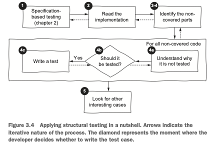

# Trabalho Prático de Teste Baseado em Especificação e Teste Estrutural
Método ``leftPad()``

AUTHOR <br>
Reginaldo

## O problema implementado a ser testado

### Descrição geral
Considere a descrição mostrada a seguir de um pequeno método que faz o preenchimento à esquerda de uma string usando outra string.

### Especificação de requisitos
- O método ``leftPad()``:
    - Preenche à esquerda uma string com uma string especificada. Preenche com um tamanho de ``size``;
    - ``public static String leftPad(final String str, final int size, String padStr)``
- ``str``: a string a ser preenchida;
    - pode ser ``null``;
- ``size``: o tamanho máximo da string preenchida;
- ``padStr``: a string usada para preencher;
    - ``null`` ou vazio é tratado como se fosse um espaço em branco;
- O método retorna:
    - uma string preenchida à esquerda,
    - a string original se o preenchimento não for necessário,
    - ou ``null`` se uma string com o valor ``null`` for dada como entrada.
- Por exemplo, se for dada a string “abc” como entrada, e o caracter “-” como string de preenchimento, e 5 como o tamanho máximo, o programa deve retornar “--abc”.


## O trabalho prático

### Instruções de entrega
A solução deve ser enviada em um arquivo em formato ``.zip`` com o nome ``RA.zip``, no qual ``<RA>`` é o número de seu RA. Por exemplo, um aluno com RA 123456 deve enviar um arquivo com o nome ``123456.zip``.

### Implemente uma solução para a especificação de requisitos
Implemente uma solução em Java usando como base o projeto ``CountWords``. Sua implementação deve obedecer à seguinte assinatura de método:

```java
public static String leftPad(final String str, final int size, String padStr)
```

### Teste a solução implementada usando teste baseado em especificação


Use o processo usado no **teste baseado em especificação** ([Figure 1](#teste-especificacao)) e elabore os testes e um relatório de teste para o método ``leftPad()`` como os já elaborados na disciplina:

1. Uma seção do relatório deve descrever o “Passo 3”, que identifica as partições:
    - Para cada entrada individualmente;
    - Para combinações de entradas;
    - Para saídas esperadas;
2. Uma seção do relatório deve descrever o “Passo 4”, que identifica os valores limite;
3. Uma seção do relatório deve descrever o “Passo 5”, em que você deve derivar os casos de teste;
4. Uma seção do relatório deve descrever o “Passo 6”, em que você deve automatizar os casos de teste usando JUnit;
5. Uma seção do relatório deve descrever o “Passo 7”, caso você aumente a suíte de testes com casos criados ou alterados a partir de seu instinto;


### Teste a solução implementada usando teste estrutural



Use o **teste estutural** ([Figure 2](#teste-estrutural)) e melhore seus testes e seu relatório, de maneira que seu relatório tenha:

1. Uma seção do relatório deve descrever o “Passo 3”, contendo as informações de cobertura de código produzido pelo Jacoco apenas com os testes baseado em especificação;
2. Uma seção do relatório deve descrever o “Passo 4”, contendo os casos de teste criados a partir da utilização do critério MC/DC:
    - Não use os outros critérios, apenas o MC/DC;
    - Deve conter a tabela verdade e uma explicação de como os testes foram derivados;
3. Uma seção do relatório deve conter as informações de cobertura de código produzido pelo Jacoco após adicionados os testes criados usando MC/DC;
4. Uma seção do relatório deve descrever eventuais erros e defeitos encontrados no código.


## Dicas
### Comandos ``mvn``:
- ``mvn install``: instala todos os artefatos necessários ao projeto no repositório local;
- ``mvn clean test``: remove todos os arquivos gerados no _build_ anterior e executa os testes;
- ``mvn jacoco:report``: gera o relatório do Jacoco;
- ``mvn site``: gera um _site_ do projeto com os relatórios gerados por outros plugins.

## Considerações finais
Tenha **certeza** de ter excluído arquivos ``.class``, ``.jar``, ``.war`` e outros ``.zip``. Não é necessário, nem se deve, enviar arquivos grandes.

Tenha **certeza** que arquivo ``<RA>.zip`` contenha:

1. O projeto Java:
    - com a solução implementada ``leafPad()``, que deve estar em uma classe do projeto;
    - de maneira que possa ser compilado no VSCode;
2. O relatório da execução dos passos do processo definido para o teste baseado em especificação:
    - com todas as seções descrevendo os passos do processo;
3. Os casos de teste gerados durante a execução do processo:
    - de maneira que possam ser executados no VSCode.